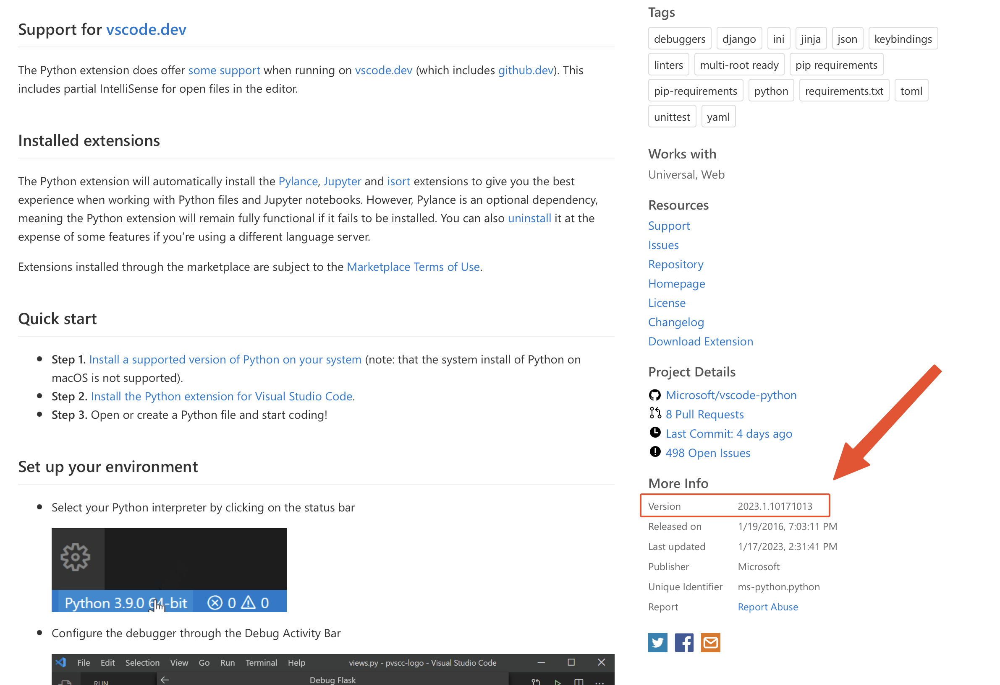

# VSIX Donwloader

The [vsix-downloader.sh](./vsix-downloader.sh) script allows you to download the _.vsix_ file installer of any [VSCODE](https://code.visualstudio.com) plugin.

You will need to provide **plugin URL** and **version**.

## Example

For downloading the [Python](https://marketplace.visualstudio.com/items?itemName=ms-python.python), its URL is:

> https://marketplace.visualstudio.com/items?itemName=ms-python.python

The _version_ can be found on the right side under _More Info_ section:

Once you provide this info, it will create the download URL and will download the file to the current location.